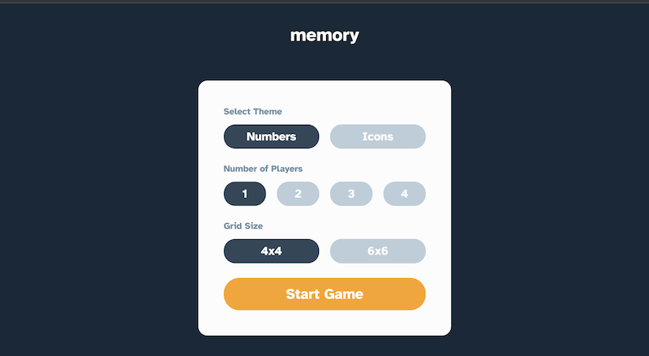
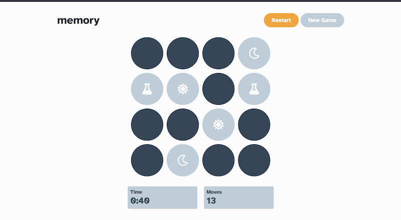
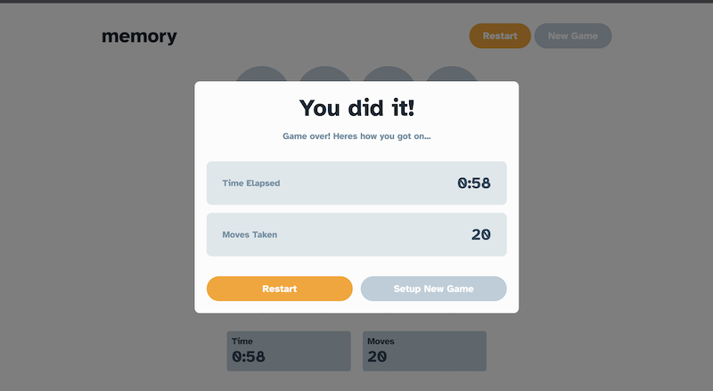

# Frontend Mentor - Memory game solution

This is a solution to the [Memory game challenge on Frontend Mentor](https://www.frontendmentor.io/challenges/memory-game-vse4WFPvM). Frontend Mentor challenges help you improve your coding skills by building realistic projects. 

## Table of contents

- [Overview](#overview)
  - [The challenge](#the-challenge)
  - [Screenshot](#screenshot)
  - [Links](#links)
- [My process](#my-process)
  - [Built with](#built-with)
  - [What I learned](#what-i-learned)


## Overview

### The challenge

Users should be able to:

- View the optimal layout for the game depending on their device's screen size
- See hover states for all interactive elements on the page
- Play the Memory game either solo or multiplayer (up to 4 players)
- Set the theme to use numbers or icons within the tiles
- Choose to play on either a 6x6 or 4x4 grid

### Screenshot






### Links

- Solution URL: [github repo](https://github.com/brodiehunt/memory-game)
- Live Site URL: [Memory game](https://brodiehunt-memory-game.netlify.app/)

## My process

### Built with
- Mobile-first workflow
- [React](https://reactjs.org/) - JS library
- [Styled Components](https://styled-components.com/) - For styles


### What I learned

Dynamic styling by passing props to styled components.

```css
  background-color: ${({$paired, $active}) => 
    $paired  ? ('var(--idle-col)') : (
        $active ? 'var(--primary-col)' : 'var(--active-col)'
    )};
```

Implementing the use effect hook. Here, the useEffect hook is used to implement the timer functionality during the memory game.
```js
useEffect(() => {
        let interval;
        if (!menuOpen && !gameOver) {
            interval = setInterval(() => {
                setTimeLapsed(prevTime => prevTime + 1);
            }, 1000);
        }

        return () => clearInterval(interval);
    }, [menuOpen, gameOver])
```


